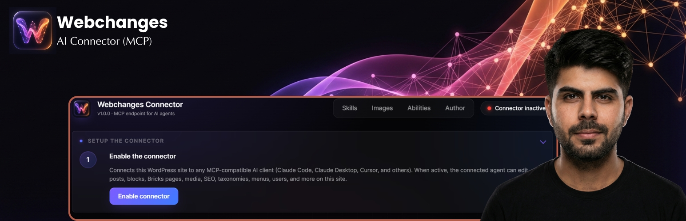

# Webchanges – AI Connector (MCP)


Turn a WordPress site into a Model Context Protocol server, so an AI client you
control can manage content, blocks, media, SEO, forms, taxonomies, menus, users,
WooCommerce, ACF and site settings — through a gated, auditable set of abilities
rather than arbitrary code.

This is the **WordPress.org (Lite) edition**: the guideline-compliant subset, with
no arbitrary code execution, no filesystem writes, no self-updater and no telemetry.

## How it works

The connector exposes exactly **three** tools over MCP, no matter how many
abilities are installed:

| Tool | Purpose |
| --- | --- |
| `webchanges/discover-abilities` | Returns the catalogue enabled on this site, plus operating instructions. Called first in a session. |
| `webchanges/get-ability-info` | Full input/output schema for one ability. |
| `webchanges/execute-ability` | Runs one ability by name. |

Everything else is reached *through* `execute-ability`. That keeps the tool list
small enough for an agent to reason about, while the site owner decides which of
the 109 abilities are reachable at all.

## Abilities

109 abilities across 17 groups, each individually switchable from the Abilities
Manager:

| Group | # | Group | # | Group | # |
| --- | --: | --- | --: | --- | --: |
| media | 14 | seo | 8 | forms | 6 |
| bricks | 12 | blocks | 6 | posts | 5 |
| elementor | 8 | image-gen | 6 | menus | 5 |
| taxonomies | 6 | stock | 6 | users | 5 |
| plugins | 5 | skills | 5 | acf | 4 |
| customizer | 4 | meta | 4 | | |

Highlights:

- **Posts, pages and blocks** — Gutenberg, Bricks and Elementor, including a
  Bricks *design compiler* that turns an HTML/CSS design into a native Bricks page.
- **Media** — upload, sideload, alt text, and autonomous in-place image
  optimization (compress, resize, WebP) run as a resumable background job.
- **SEO** — Rank Math and Yoast meta, redirects, Yoast Search Appearance.
- **Forms** — Formidable, Fluent Forms, WPForms and Forminator: create and edit
  forms, settings, notifications, and list submissions.
- **Skills** — markdown playbooks bundled with the plugin that an agent can pull
  on demand, plus a `skill-creator` for writing new ones.

## Security model

- The MCP transport requires the **`manage_options`** capability. The adapter's
  shared default server is explicitly disabled so no lower-privileged endpoint
  can enumerate the ability catalogue.
- Authentication uses a standard WordPress **Application Password** — no bespoke
  token store, revocable from the user's profile at any time.
- **No arbitrary code execution and no filesystem write abilities** ship in this
  edition. High-risk abilities are off for new installs and enabled deliberately.
- Provider API keys are **encrypted at rest** and never rendered in full.

## Requirements

- WordPress **6.9 or newer** — the Abilities API this plugin builds on ships in
  core from 6.9.
- PHP **8.0+**.
- An MCP-compatible AI client (Claude Code, Claude Desktop, Cursor, and others).

## Installation

1. Install and activate the plugin.
2. Open **Webchanges** in the admin menu and enable the connector.
3. Create a WordPress Application Password when prompted.
4. Point your MCP client at the endpoint shown on that page:

   ```
   /wp-json/webchanges/v1/mcp
   ```

5. Enable the abilities you want from the **Abilities Manager**.

## External services

The plugin contacts nothing on its own initiative — no background calls, no
activation ping, no telemetry. Third-party services are reached only when an
action you run uses one, and every provider except Pollinations requires you to
save an API key first:

| Service | Used for | Key required |
| --- | --- | --- |
| OpenAI | Image generation and editing | Yes |
| Google Gemini / Imagen | Image generation | Yes |
| Replicate | Image generation | Yes |
| Pollinations | Image generation | No |
| Pexels, Unsplash, Pixabay | Stock photos | Yes |

Full disclosure, including what is sent and links to each provider's terms, is in
[`readme.txt`](readme.txt).

## Editions

| | Lite (this repo) | Full |
| --- | --- | --- |
| Distribution | WordPress.org | Private |
| Arbitrary code / filesystem abilities | No | Yes |
| Updates | WordPress.org | GitHub self-update |

Feature work lands in the full build first and is then ported here, minus the
abilities that WordPress.org guidelines exclude.

## Development

`vendor/` is committed deliberately — it holds the pinned, Jetpack-autoloaded
runtime tree the plugin ships with. Do **not** run `composer install` or
`composer update` against it.

To build a distributable zip:

```bash
python .github/build-zip.py
```

It excludes every dot-file and dot-directory (WordPress.org rejects hidden
files) and refuses to build if the version strings disagree, if a second file
carries a `Plugin Name:` header, or if anything hidden would ship.

CI runs the same script: [Plugin Check](.github/workflows/plugin-check.yml) on
every push, and [Release](.github/workflows/release.yml) on a version tag, which
publishes the zip as a release asset.

## Installing from GitHub

Use a [release asset](../../releases), not the green **Code -> Download ZIP**
button. That button produces a *source archive* named `<repo>-<branch>`, so it
unpacks to `webchanges-ai-connector-mcp-main/` and keeps dot-files -- WordPress
then treats it as a differently-slugged plugin and Plugin Check reports a text
domain mismatch on every string.

## License

[GPL-2.0-or-later](LICENSE). All bundled dependencies (`automattic/jetpack-autoloader`,
`wordpress/mcp-adapter`, `wordpress/php-mcp-schema`) are GPL-2.0-or-later.

## Author

**Shahbaz Dev** — [shahbazdev.com](https://shahbazdev.com/)
